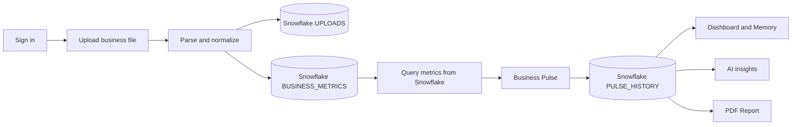

<div align="center">

# Ledgerly

### Your business speaks.

**Turn the files you already have into the clarity you wish you had.**

[Product](#the-product) · [Architecture](#architecture) · [Run locally](#developer-setup) · [Deploy](#deployment)

</div>

---

Every business creates a trail of truth: a spreadsheet from the accountant, a bank export, a monthly statement, a folder of PDFs. The answers are in there—but for most owners, they remain trapped behind rows, tabs, and financial language.

Ledgerly makes that truth understandable.

Upload the business data you already use. Ledgerly detects the important signals, builds an explainable **Business Pulse™**, remembers how the business has changed, and lets you ask questions in plain language. No new reporting ritual. No wall of charts. Just a clear conversation with your business.

> Ledgerly explains uploaded data. It does not provide investment, pricing, hiring, or financial recommendations, and never guarantees an outcome.

## The problem

Small teams rarely have a data team. Owners make consequential decisions while switching between disconnected exports, dashboards built for accountants, and summaries that arrive too late. Traditional BI expects clean warehouses and specialist knowledge. Generic AI chat lacks persistent business context and often crosses the line from explanation into advice.

The result is not a lack of data. It is a lack of understanding.

## The vision

Ledgerly is building the easiest way for an owner, accountant, or manager to understand a business. The long-term product is a trusted intelligence layer that sits above everyday business data—continuous, explainable, context-aware, and human enough to use every morning.

## Why Ledgerly

- **Clarity before complexity.** Important changes appear first, in language a busy operator can understand.
- **Memory, not snapshots.** Every upload becomes part of the business timeline.
- **Evidence, not magic.** Scores expose their factors, weights, and confidence.
- **Safe by design.** The AI explains the data it can see and refuses advice outside that boundary.
- **A gentle path in.** CSV, Excel, PDF, and JSON work without a data integration project.

## Features

| Capability | What it does |
| --- | --- |
| Multi-format ingestion | Parses CSV, XLSX, PDF, and JSON with type and size validation |
| KPI detection | Recognizes revenue, expenses, profit, cash, and derived margin |
| Business Pulse™ | Produces a bounded score with visible factors and confidence |
| Business Memory | Stores uploads and compares matching metrics over time |
| Interactive analytics | Responsive revenue, expense, margin, and category views |
| Ask Ledgerly | Gemini-powered, data-grounded explanations with explicit guardrails |
| PDF reporting | Generates a portable executive snapshot of the latest pulse |
| Authentication | Token-based user isolation with Argon2 password hashing |
| Production workflow | Docker, CI, pre-commit quality gates, Vercel and Render configuration |

## Screenshots

<table>
  <tr>
    <td width="50%"><strong>Business Pulse dashboard</strong><br/><em>Screenshot placeholder — overview, KPIs, trends, and explainable score.</em></td>
    <td width="50%"><strong>Talk to your business</strong><br/><em>Screenshot placeholder — grounded questions, confidence, and source context.</em></td>
  </tr>
  <tr>
    <td><strong>Business Memory</strong><br/><em>Screenshot placeholder — historical uploads and period comparisons.</em></td>
    <td><strong>Executive report</strong><br/><em>Screenshot placeholder — export-ready PDF pulse report.</em></td>
  </tr>
</table>

## Architecture

```text
ledgerly/
├── frontend/                   Next.js App Router, strict TypeScript, Tailwind
│   └── src/app/                Dashboard, login, interaction surfaces
├── backend/
│   ├── app/api/                Versioned HTTP interface
│   ├── app/ai/                 Gemini adapter and safety policy
│   ├── app/business_engine/    Parsing, KPI detection, Snowflake storage
│   ├── app/business_pulse/     Explainable scoring and comparison
│   ├── app/report_engine/      PDF generation
│   ├── app/core/               Configuration, database, security
│   └── tests/                  API, parser, and scoring tests
├── snowflake/                  CoCo bootstrap, warehouse DDL, verification
├── .github/workflows/          Deployability gates
├── docker-compose.yml          Local full-stack environment
└── render.yaml                 Backend infrastructure definition
```

The frontend never owns business calculations. FastAPI preserves the existing authentication boundary, while Snowflake owns normalized uploads, detected metrics, and Pulse history. The Business Pulse engine scores metrics only after reading them back from Snowflake. Chat, dashboard memory, and PDF reporting consume that same warehouse-backed Pulse representation, preventing product surfaces from drifting apart.

### Core flow



This lineage is intentional and testable: **CSV upload → Snowflake insert → Snowflake query → Business Pulse → AI insights → dashboard → PDF report**.

## Developer setup

### Requirements

- Node.js 22+
- Python 3.12+
- npm 10+
- A Snowflake account and the Snowflake Cortex Code (CoCo) CLI for the warehouse-backed flow

### 1. Configure the API

```bash
cd backend
python -m venv .venv
source .venv/bin/activate       # Windows: .venv\Scripts\activate
pip install -r requirements-dev.txt
cp .env.example .env
uvicorn app.main:app --reload
```

Add a Gemini API key to `backend/.env` to enable generated explanations. Without one, Ledgerly remains functional and returns deterministic, data-grounded summaries.

### 2. Bootstrap Snowflake with CoCo CLI

Install CoCo on Windows:

```powershell
irm https://ai.snowflake.com/static/cc-scripts/install.ps1 | iex
cortex --version
```

Run `cortex`, create a connection named `ledgerly`, and select the Ledgerly project directory. Then let CoCo create and verify the warehouse objects:

```bash
cortex -c ledgerly -w . -f snowflake/coco-bootstrap.prompt
```

Copy the Snowflake values from `backend/.env.example` into `backend/.env`. Credentials are never committed. The full connection, role, SQL, and troubleshooting walkthrough is in [Snowflake + CoCo setup](docs/SNOWFLAKE_COCO.md).

### 3. Start the product

```bash
cd frontend
cp .env.example .env.local
npm install
npm run dev
```

Open `http://localhost:3000`. API documentation is available at `http://localhost:8000/docs`.

### 4. Verify the deployable state

```bash
npm --prefix frontend run lint
npm --prefix frontend run typecheck
npm --prefix frontend run build
python -m pytest backend/tests
```

Git hooks can enforce the same checks before every commit:

```bash
git config core.hooksPath .githooks
```

### Hackathon demo flow

1. Register or sign in; authentication remains isolated from business storage.
2. Upload `CSV`, `XLSX`, `PDF`, or `JSON` business data.
3. Show `LEDGERLY.BUSINESS.UPLOADS` and `BUSINESS_METRICS` in Snowsight or CoCo.
4. Open Business Pulse™; its metrics were queried back from Snowflake before scoring.
5. Ask a question in Talk to your Business; the context comes from the latest Snowflake upload and Pulse.
6. Export the PDF; it uses the same Snowflake-backed Pulse shown on the dashboard.
7. Run `snowflake/verify.sql` to show the complete per-user lineage.

## API surface

| Method | Endpoint | Purpose |
| --- | --- | --- |
| `POST` | `/api/v1/auth/register` | Create an isolated workspace user |
| `POST` | `/api/v1/auth/login` | Issue an access token |
| `POST` | `/api/v1/uploads` | Parse data and create a Business Pulse |
| `GET` | `/api/v1/uploads` | Read Business Memory |
| `GET` | `/api/v1/pulse/latest` | Read score, factors, confidence, and comparison |
| `POST` | `/api/v1/chat` | Ask a bounded question about the latest context |
| `GET` | `/api/v1/reports/latest.pdf` | Export the latest executive report |
| `GET` | `/health` | Deployment health check |

## Deployment

### Frontend · Vercel

1. Import the repository into Vercel.
2. Set the root directory to `frontend`.
3. Add `NEXT_PUBLIC_API_URL` with the production Render URL.
4. Add `NEXT_PUBLIC_APP_URL` with the Vercel production URL.
5. Deploy. `vercel.json` and the Next.js standalone build are already configured.

### Backend · Render

Open the [Ledgerly Render Blueprint](https://render.com/deploy?repo=https://github.com/Saidur-droid/ledgerly) and apply it. The Blueprint contains the production Vercel origin, generates its signing secret, and asks for the Supabase PostgreSQL `DATABASE_URL`. Follow the complete [Render deployment checklist](docs/RENDER_DEPLOYMENT.md) to verify health and CORS after launch.

The Blueprint deploys only after GitHub checks pass, generates `SECRET_KEY`, pins Python, binds Uvicorn to Render’s runtime port, and allows exactly `https://ledgerly-one-xi.vercel.app`. Versioned SQL migrations run at API startup, so no Supabase CLI is required. Gemini can be enabled later with `GEMINI_API_KEY`; without it, the safe deterministic explanation fallback remains active. See [Supabase PostgreSQL operations](docs/SUPABASE_POSTGRES.md).

Add `SNOWFLAKE_ACCOUNT`, `SNOWFLAKE_USER`, and `SNOWFLAKE_PASSWORD` as Render secrets. The Blueprint supplies the warehouse, database, and schema names. Ledgerly activates Snowflake only when the full credential set exists, allowing a no-downtime deployment before secret provisioning. Confirm activation at `/health`: `business_storage` must read `snowflake`.

## Security

- Passwords use Argon2; plaintext passwords are never stored.
- User-owned upload history is filtered server-side.
- Upload type and size are validated before parsing.
- Secrets are environment-only and excluded from version control.
- CORS is restricted to the configured frontend origin.
- AI context is scoped to the authenticated user’s latest upload.
- Generated text carries a visible boundary against financial advice.

Before handling sensitive production data, add malware scanning, object storage encryption, signed upload URLs, rate limiting, structured audit logs, database backups, secret rotation, and an external security review. See [SECURITY.md](SECURITY.md).

## Scalability

Ledgerly separates operational identity data from analytical business data. Snowflake scales uploads, metric history, and Pulse queries independently, while the compatibility storage path keeps local development frictionless:

1. Move file bytes to S3-compatible object storage.
2. Apply versioned SQL migrations automatically at API startup.
3. Queue parsing and report generation as background jobs.
4. Store semantic business context separately from raw rows.
5. Add organization membership and role-based authorization.
6. Cache versioned Pulse results and stream longer AI responses.

The Business Engine, Pulse, Memory, AI, and Report modules are independent so each can evolve at a different pace.

## Roadmap

**Now:** dependable uploads, KPI detection, explainable Pulse, memory, chat, PDF, responsive product surface.

**Next:** richer date inference, bank/accounting connectors, anomaly explanations, organization roles, scheduled reports, and human-reviewed metric mappings.

**Later:** continuous business context, collaborative narratives, vertical-specific Pulse models, and privacy-preserving benchmarking—always explanation-first.

## Contributing

Ledgerly values small, reviewable changes that preserve the product’s trust boundary. Read [CONTRIBUTING.md](CONTRIBUTING.md), open an issue before a structural change, and keep `main` deployable. Conventional Commits are required.

## FAQ

<details>
<summary><strong>Does Ledgerly make business decisions for me?</strong></summary>
No. It explains and compares the uploaded data. It does not recommend investments, prices, or hiring decisions and does not guarantee outcomes.
</details>

<details>
<summary><strong>What happens when a file uses unusual column names?</strong></summary>
Ledgerly returns a lower confidence score and exposes the detection gap instead of inventing a metric. The parsing layer is designed to add reviewed aliases and mappings over time.
</details>

<details>
<summary><strong>How do I know the app is using Snowflake?</strong></summary>
Call `/health` and verify `business_storage` is `snowflake`. Then run `snowflake/verify.sql`; each upload should have metric rows and a matching Pulse record.
</details>

<details>
<summary><strong>Is Gemini required to run the app?</strong></summary>
No. Uploading, KPI detection, Pulse scoring, memory, comparisons, and reports work without an API key. Gemini enriches the explanation experience.
</details>

## License

Ledgerly is available under the [MIT License](LICENSE).

<div align="center">
  <br/>
  <strong>Ledgerly</strong><br/>
  <sub>Your business speaks.</sub>
</div>
